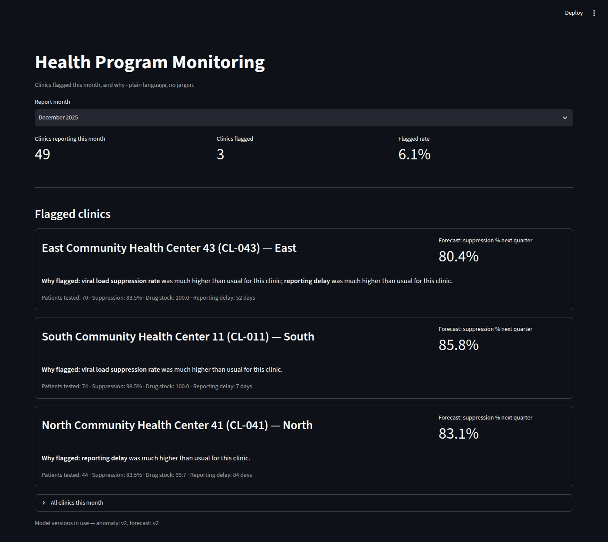

# health-data-pipeline

An infra-first ML platform demo built around a synthetic health-program data warehouse:
data ingestion, data-quality validation, an anomaly detector, a forecasting model, and
the MLOps/orchestration/serving layer around them. This is a portfolio/interview
artifact for an AI/ML Engineer role focused on data-warehouse integration in the
health/NGO domain — depth lives in reliability and structure, not model novelty. See
`project-brief.md` for the original scope and priorities this was built against.

**No real patient data is used anywhere in this repo.** Everything is synthetically
generated (see "Data & reproducibility" below).

## What it does, in plain language

Every month, ~50 fake clinics report a handful of indicators (patients tested, viral
load suppression rate, drug stock level, reporting delay). This pipeline:

1. Pulls that month's reports into a warehouse.
2. Checks them for data-quality problems and quarantines anything suspicious instead of
   silently accepting or hard-failing.
3. Flags clinic-months that look unusual compared to that same clinic's own history, and
   explains *why* in plain language (not jargon).
4. Forecasts each clinic's suppression rate three months out.
5. Serves both through an API and a one-page dashboard: "clinics flagged this month, and
   why."

## Quickstart

```
cd infra
./generate-secret.sh  # optional: puts a random AIRFLOW_SECRET_KEY in infra/.env
                       # instead of every clone sharing the placeholder default
docker compose up -d --build
```

Compose brings up two Postgres instances (the health-program warehouse and Airflow's own
metadata DB), runs the Alembic migration, initializes Airflow, and starts MLflow, the
API, and the dashboard, in dependency order. Then:

```
# generate synthetic data (first run only) - the DAG's own `ingest` task
# loads it into the warehouse, since data_gen/output/ is bind-mounted into
# the Airflow containers at the same relative path
uv run python -m data_gen.generate
docker exec infra-airflow-scheduler-1 airflow dags unpause health_pipeline
docker exec infra-airflow-scheduler-1 airflow dags trigger health_pipeline
```

| Service | URL |
|---|---|
| Airflow UI | http://localhost:8080 (admin/admin) |
| MLflow UI | http://localhost:5001 |
| Serving API | http://localhost:8000/health, http://localhost:8000/facilities/{facility_id}/score |
| Dashboard | http://localhost:8501 |

Architecture and the DAG's task graph: [`docs/architecture.md`](docs/architecture.md).
Alerting design: [`docs/monitoring.md`](docs/monitoring.md).

### What it looks like



```
$ curl -s http://localhost:8000/facilities/CL-043/score | python3 -m json.tool
{
    "facility_id": "CL-043",
    "report_month": "2025-12-01",
    "is_anomaly": true,
    "anomaly_score": 0.08199125630799808,
    "anomaly_reasons": [
        {"field": "suppression_pct", "z_score": 2.48, "direction": "high"},
        {"field": "reporting_delay_days", "z_score": 3.06, "direction": "high"}
    ],
    "forecast_next_quarter_suppression_pct": 80.37204207405985,
    "model_version_anomaly": "2",
    "model_version_forecast": "2"
}
```

## Data & reproducibility

`data_gen/generate.py` produces ~50 facilities × 24 months (~1,200 base rows) of
seasonally-varying indicators, then injects realistic problems (missing months,
duplicate facility submissions, outlier spikes, delayed reports) while keeping a
**ground-truth ledger** of every injected issue (`data_gen/output/ground_truth_anomalies.csv`)
— this is what the anomaly detector is evaluated against later.

A single constant, `SEED = 42` (`data_gen/config.py`), drives all randomness. Re-running
`uv run python -m data_gen.generate` reproduces byte-identical output — this is tested
directly in `tests/test_generate.py`.

**Scale caveat:** ~1,200 rows is small on purpose. The point of this project is
reliability and structure, not scale — see "Limitations" below.

## The idempotency invariant

**Any DAG task can be re-run for any period without corrupting the warehouse.**

- `ingest` and `score` upsert on `(facility_id, report_month)` via
  `INSERT ... ON CONFLICT DO UPDATE` — a re-run overwrites, never duplicates.
- Every task is parameterized by the DAG's logical date, never `now()`, so backfills are
  safe.
- `score` always recomputes over the *entire* `monthly_reports` table, not just the
  current run's batch, because the anomaly detector's features are z-scores relative to
  each facility's own history — one new row shifts the mean/std for every other row from
  that facility. This still lands idempotently via the same upsert.

## Data-quality validation

Structural checks (not-null, ranges, uniqueness, referential integrity) are enforced by
the warehouse schema itself. The `validate` task (`validation/checks.py`) runs the
checks that need judgment: unknown facility IDs, duplicate submissions, indicator range
violations, statistical outliers (robust z-score, median/MAD), and reporting
completeness gaps. **Failure policy: quarantine bad rows + continue + alert — never
hard-fail the whole run over a few bad rows.**

A representative run against the full synthetic dataset:

| | |
|---|---|
| Batch size | 1,188 rows |
| Clean | 1,121 (94.4%) |
| Quarantined | 67 (5.6%) — 42 duplicate submissions, 25 statistical outliers |
| Completeness gaps | 33 facility-months absent entirely |

Every validate run emits a structured JSON + HTML report as a DAG artifact
(`validation/output/{run_id}_report.json`), including an `alert_quarantine_rate_exceeded`
flag (fires above a 10% quarantine rate).

## Models

### Anomaly / data-quality detector

`sklearn.IsolationForest` over facility-normalized indicator z-scores (`models/anomaly.py`),
with `contamination = 0.05` fixed as a business assumption — **not** tuned against the
ground-truth labels, since tuning against the same labels used for evaluation would make
the reported precision/recall meaningless.

Evaluated against the ground-truth ledger, restricted to the injected anomalies that
actually survive into `monthly_reports` (the rest were already caught upstream by
validation):

| Metric | Value |
|---|---|
| Precision | 0.57 |
| Recall | 0.54 |
| False-positive rate | 2.3% |

Modest precision/recall are expected and honest at this scale (59 true anomaly-candidate
rows in the clean fact table) — this is a measured detector, not a tuned one.

**Explainability:** per-feature z-scores ("which indicator was abnormal and by how
much"), not SHAP — IsolationForest is unsupervised, so z-scores are both more honest and
more plain-language for the dashboard than a SHAP value would be.

### Forecasting model

Gradient-boosted trees over lag/rolling features (`models/forecast.py`), predicting each
facility's suppression rate three months out. Chosen over Prophet for lighter
dependencies and to pair cleanly with SHAP.

| Metric | Value |
|---|---|
| MAE (model) | 2.89 |
| MAE (naive last-value baseline) | 3.43 |
| Improvement over baseline | 15.75% |

**Explainability:** SHAP (clean, supervised) — top drivers are typically each facility's
own trailing 3-month suppression average and its most recent lag values.

Every training run logs params, metrics, and artifacts to MLflow, and is registered to
the Model Registry by a separate `register` task — see `docs/architecture.md` for why
train/register/score are kept as distinct steps.

## Serving & dashboard

`api/main.py` (FastAPI) loads the *currently registered* anomaly + forecast models from
MLflow — the identical load path the `score` DAG task uses — and serves live per-facility
inference with Pydantic-validated responses, a `/health` endpoint, and `model_version` on
every response.

`dashboard/app.py` (Streamlit) is a single page reading directly from `scored_reports`:
which clinics are flagged this month, why (in plain language), and their forecast for
next quarter — no jargon, meant to be readable by a non-technical program manager.

## MLOps, CI/CD, IaC

- **MLflow** tracks every run and backs a real Model Registry (SQLite-backed tracking
  store; artifacts proxied through the tracking server rather than a shared filesystem,
  since every service that needs a model is a separate container).
- **CI** (`.github/workflows/ci.yml`): a single lint → test → build path — ruff, pytest
  (see `tests/`, covering the validation suite, feature engineering, the anomaly
  detector's explanation logic, and data-generator reproducibility), and a Docker build
  of the `api` image.
- **IaC** (`infra/terraform/`): a minimal, intentionally-unapplied stub — an ECR
  repository and a single-task Fargate service for the `api` image — proving out the
  cloud/containerized deployment shape without standing up the whole stack in a real
  account. Scope and rationale: `infra/terraform/README.md`.

## Limitations

- **Scale.** ~1,200 rows across 50 synthetic facilities. Real precision/recall/MAE at
  production scale would differ, likely favorably (more history per facility, more
  anomaly examples).
- **No hyperparameter tuning.** Deliberate — see `project-brief.md`'s non-goals; models
  are meant to be simple and well-evaluated, not novel.
- **No registry promotion gate.** `models/register.py` promotes every training run's
  candidate unconditionally. A real version would gate promotion on the candidate
  beating the currently-registered version's metrics.
- **No auth** on the API or dashboard — out of scope for this demo.
- **Batch only, monthly.** No streaming — scoped deliberately.
- **Alerting is designed, not wired.** The validation report already computes an
  exceeded-threshold flag; nothing routes it to a real notification channel yet. See
  `docs/monitoring.md` for the full gap list.
- **Terraform stub covers only the `api` service**, not the rest of the stack (see
  `infra/terraform/README.md`).
- **Existing `mlflow_data` volumes predate the non-root `mlflow` user** in
  `infra/Dockerfile.mlflow`. If you ran `docker compose up mlflow` before that change,
  the volume is still root-owned and writes will fail with `readonly database` until you
  run this once:
  `docker run --rm -v infra_mlflow_data:/mlflow python:3.12-slim chown -R 1000:1000 /mlflow`.
  A fresh clone/volume doesn't need this — only pre-existing local checkouts.

## Recommended next steps for a real production version

1. Extend `infra/terraform/` to cover the full stack — RDS instead of a container
   Postgres, a managed MLflow tracking server with S3-backed artifacts, a managed
   orchestrator (MWAA or similar) instead of a single-node LocalExecutor.
2. Wire the validation report's `alert_quarantine_rate_exceeded` flag, DAG task
   failures, and model-drift signals to a real channel (Slack/PagerDuty) — see
   `docs/monitoring.md`.
3. Add a registry promotion gate that compares a candidate's eval metrics against the
   currently-registered version before promoting.
4. Add auth to the API and dashboard.
5. Extend CI to push the built image to a registry and (optionally) trigger a Terraform
   apply on merge to main.
6. Validate the anomaly detector and forecaster against a real (larger, longer-history)
   dataset before trusting the reported metrics at production scale.
7. Rotate every credential in `infra/docker-compose.yml` before any real deployment —
   the Postgres passwords and Airflow's `admin/admin` login are hardcoded for
   local-demo convenience only. `AIRFLOW__WEBSERVER__SECRET_KEY` can already be
   randomized per checkout via `infra/generate-secret.sh` (see Quickstart); the
   Postgres/Airflow-login credentials still need a real secrets mechanism (e.g.
   Docker/Compose secrets or a vault) since they're also embedded in connection-string
   env vars used across several services.

## Repo layout

```
health-data-pipeline/
├── data_gen/            # synthetic data generator + ground-truth anomaly ledger
├── warehouse/           # schema, migrations, structural constraints
├── validation/          # semantic data-quality check suite + report
├── dags/                # Airflow DAG
├── models/              # training + scoring scripts, MLflow logging, SHAP
├── api/                 # FastAPI service
├── dashboard/           # Streamlit app
├── infra/               # Dockerfiles, docker-compose.yml, terraform/
├── .github/workflows/   # CI
├── docs/                # architecture.md, monitoring.md
└── tests/
```

## Technical appendix

### Local development without Docker

```
uv sync
uv run python -m data_gen.generate

# a local Postgres for warehouse/db.py's default DATABASE_URL (localhost:5433) -
# distinct from the port docker-compose's `postgres` service uses (5442), so both
# can run at once without colliding:
docker run -d --name health_pipeline_db -p 5433:5432 \
  -e POSTGRES_USER=health -e POSTGRES_PASSWORD=health -e POSTGRES_DB=health_pipeline \
  postgres:16-alpine

uv run alembic -c warehouse/alembic.ini upgrade head
uv run python -m warehouse.ingest --run-id local-1 --dag-logical-date 2024-01-01
uv run python -m validation.run --run-id local-1 --dag-logical-date 2024-01-01
uv run python -m models.anomaly
uv run python -m models.forecast
```

### Tests and linting

```
uv run ruff check .
uv run pytest -q
```

### Regenerating data with a different seed

Change `SEED` in `data_gen/config.py`, re-run `uv run python -m data_gen.generate`, and
re-ingest — every downstream step (validation, training, scoring) is deterministic given
the same warehouse contents.
