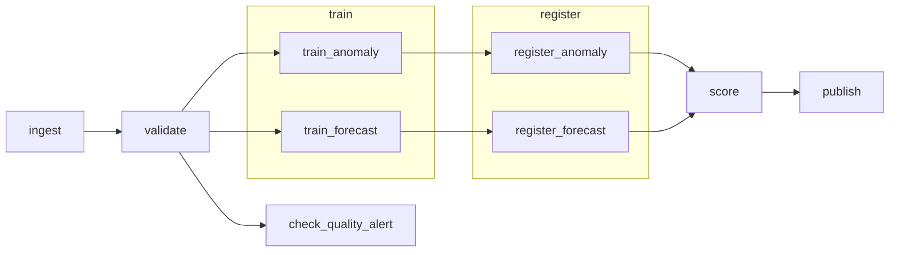
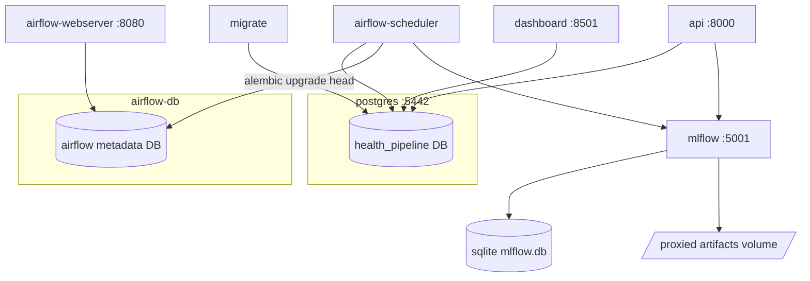

# Architecture

## DAG task graph

The `health_pipeline` Airflow DAG (`dags/health_pipeline_dag.py`) runs monthly and drives
everything downstream of the raw data:



- **check_quality_alert** is a sibling of `train`, not a blocking predecessor: it reads
  the `validate` task's own report and fails (visibly, in the Airflow UI) if
  `alert_quarantine_rate_exceeded` is set, without stopping `train`/`score`/`publish` on
  the rows that did pass validation — see `docs/monitoring.md`.
- **train** and **score** are separate tasks on purpose: `train` is a scheduled batch job
  that logs a candidate model to MLflow; `register` promotes it to the Model Registry;
  `score` pulls the *registered* model and writes flags/forecasts. `api/main.py` loads
  models the same way `score` does — one registry, one load path.
- Every task is parameterized by the DAG's own `run_id` and logical date (never `now()`),
  and every write is an `INSERT ... ON CONFLICT DO UPDATE` keyed on
  `(facility_id, report_month)` — see the **idempotency invariant** in the README. Any
  task can be safely cleared and re-run for any period.
- Retries: 2, 5-minute delay, set at the DAG's `default_args`.

## Data flow

```
data_gen/generate.py           (seeded synthetic generator)
  → data_gen/output/*.csv       (facilities, raw reports, ground-truth anomaly ledger)
  → warehouse.raw_monthly_reports   (ingest task — full-refresh landing zone)
  → validation/checks.py            (validate task — semantic checks)
      ├─→ warehouse.monthly_reports      (clean fact table)
      └─→ warehouse.quarantined_reports  (rejected rows + reason)
  → models/anomaly.py, models/forecast.py   (train task — reads monthly_reports)
  → MLflow tracking + Model Registry         (register task)
  → models/score.py                          (score task — reads the registry)
  → warehouse.scored_reports                 (model output, keyed like monthly_reports)
  → reports/latest_summary.json + .html      (publish task)
  → api/main.py, dashboard/app.py             (serve the registry / scored_reports)
```

Structural data-quality constraints (not-null, ranges, uniqueness, FK) live in the
warehouse schema itself (`warehouse/models.py`); semantic checks (duplicate submissions,
statistical outliers, completeness gaps) live in `validation/checks.py` and produce a
structured report rather than hard-failing the run — see `docs/monitoring.md` for the
failure policy.

## Service / container topology



All of this is defined in `infra/docker-compose.yml`. Two separate Postgres instances
are deliberate: `postgres` is the health-program warehouse a reviewer would actually
query; `airflow-db` is Airflow's own metadata store — keeping them apart means Airflow's
schema never shares a database with the domain data.

MLflow artifacts are proxied through the tracking server (`mlflow-artifacts:/` +
`--serve-artifacts`) rather than a shared filesystem volume, since `train`/`register`/
`score`/`api` are separate containers with no common disk — see
`infra/Dockerfile.mlflow`.

## Component responsibilities

| Component | Responsibility | Key files |
|---|---|---|
| Data generator | Seeded synthetic dataset + ground-truth anomaly ledger | `data_gen/` |
| Warehouse | Schema, Alembic migrations, structural constraints | `warehouse/` |
| Validation | Semantic data-quality checks, quarantine + report | `validation/` |
| Orchestration | `ingest → validate → train → register → score → publish` | `dags/` |
| Models | Anomaly detection (IsolationForest), forecasting (GBM + SHAP) | `models/` |
| Serving API | FastAPI, loads the registered model, `/health` + scoring endpoint | `api/` |
| Dashboard | Streamlit, "clinics flagged this month and why" | `dashboard/` |
| Infra | Dockerfiles, docker-compose, a Terraform stub for the api service | `infra/` |
| CI | Dependency drift + vulnerability checks, lint, test (against a real Postgres), build all four images | `.github/workflows/` |

## Deployment note

Everything above runs locally via `docker compose up` — this is a portfolio/demo
project, not a deployed service (see `project-brief.md`'s explicit non-goals).
`infra/terraform/` is a stub proving out the cloud/containerized deployment shape for
the `api` service (ECR + a Fargate service); it is not applied. A real production
version would extend that stub to cover the rest of the stack — see the README's
"next steps" section.
